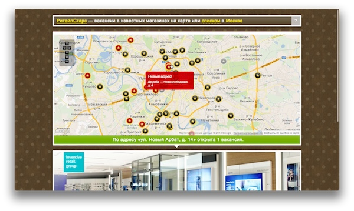

### Inshaker

[Inshaker](http://www.inshaker.ru/) is the Russian site about cocktails, bars, bartenders, and all [the cocktail culture](https://www.facebook.com/inshaker) as a whole. Launched in 2009 it is known to use as much of presentational technology as it is sane to.

As a the Lead Front-end Developer I did all kinds of tasks here: pixel perfect markup, vanilla JS coding, implementing widgets, UI design, and more. All the widgets are hand made with love. This project survived zillions of redesigns, markup refactorings, logic and UI rewrites, and, especially the migration from Liby 0.1 to Liby 0.3 with all new portability layer, event system, etc. As a result of such a significant period of evolution the project has got a strict MVC implementation, in-memory database with indices, lazy-everything lists, and blazing fast content rendering and caching technics. I'm proud of this imperfect but very well shaped peace of software :)

As a team leader I was responsible to build, teach and coordinate a small changing team of programmers connecting them with the management.

I also did all the backend stuff with all them servers, round-robins, caches, etc.

### RetailStars

[RetailStars](http://www.retailstars.ru/) is a head hunting agency dedicated to retail. It covers more than 40 cities all over the Russia. Launched in 2008 with all dynamic interface it was a breakthrough in the job site market. People loved the interface so much that they sent us filled forms just for fun.

As a the Lead Front-end Developer I did, again, all kinds of tasks here: pixel perfect markup, vanilla JS coding, implementing lots of widgets, UI design (with two successful redesigns) and more. All the widgets are built from scratch and are cross-browser starting with MSIE 6.

For an experienced backend developer it was a pleasure for me to make some server-side magic here.

### Programica

Back in late 2007, [Programica](http://www.programica.ru/) was a small startup focused on building dynamic web sites with rich interfaces and animation known now as HTML5. We planned to take on outsource all the front end development. And we got a huge project — Inshaker.ru (see above) — which is alive and growing till now.

As a the Front-end Developer I did, for the first time, all kinds of tasks here: zoomable pixel perfect markup, vanilla JS coding giving birth to [Liby.js](https://github.com/kung-fu-tzu/liby), implemented the job widget, ported and embedded lots of widgets from our recent projects. As you might expect all the unique widgets are built from scratch and are cross-browser starting with MSIE 6.

### More examples coming soon

If you feel an interest in my work, please, check out [my resume](/pages/resume.html).
