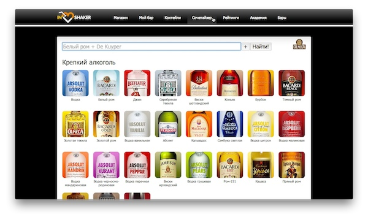

### Inshaker

Inshaker is the Russian site about cocktails, bars, bartenders, and all [the cocktail culture](https://www.facebook.com/inshaker) as a whole. Launched in 2009 it is known to use as much of the client-side technology as it is sane to.

As a front-end developer I've done all kinds of tasks here: pixel perfect markup, vanilla JS coding, implementing widgets, UI design, and more. All the widgets are hand made.

I also did all the backend stuff with all them servers, round-robins, caches, etc.

For more details see [my resume](/pages/resume.html), please.